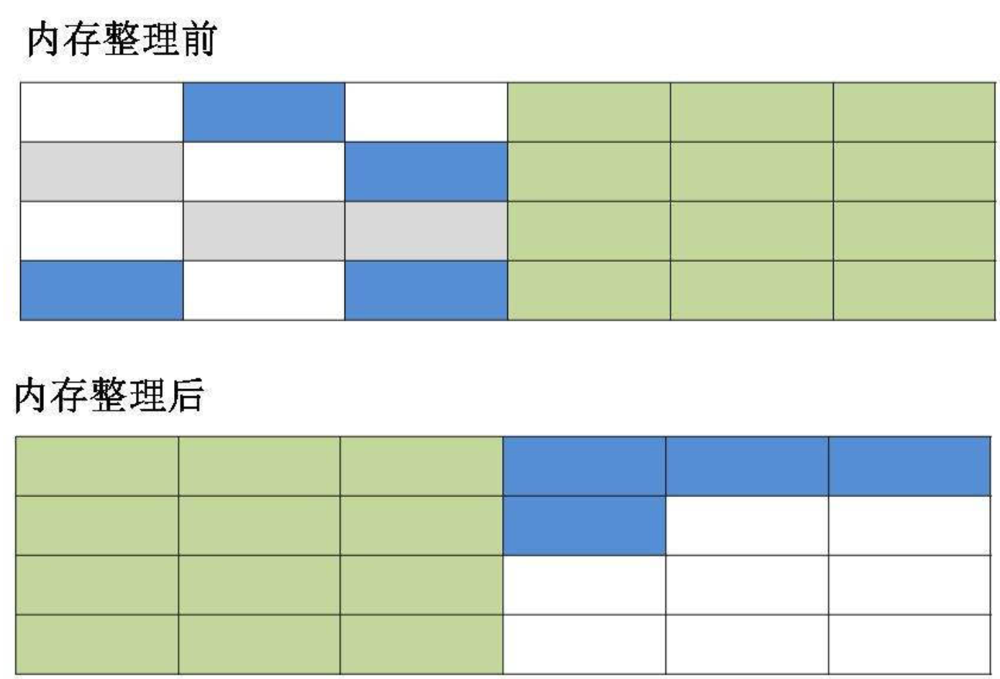

# Garbage Collection

## Compacting GC：

压缩算法概述 ： 不划分WASM运行时内存， 即Canister除RTS占用的内存外， 都是heap内存 -> Canister : 4 G

* 首先，遍历heap， 找出所有的活体对象（正在活动/被活动的对象引用），  标记活体对象。标记完后剩下的就是不被引用或者不再使用的对象， 即内存垃圾。然后，清理Heap内存并将活体对象前移。 
* 

* 绿色是未使用内存， 蓝色是存活对象， 灰色是内存垃圾， 白色是可用内存

## Motoko GC Algorithm 选择：

对执行效率要求高， 但是不存储数据的Canister， 建议选用Coping GC(Minor GC)，即当前的gc。

对执行效率要求不高， 存储数据（或存储索引数据），或者Canister中保存的活体对象比较多的情况下， 建议用Compacting GC。 Compacting GC消耗的Cycle比Coping GC多。

现在moc中还有一个测试CLI 命令， 可以在平时禁用GC， 待upgrade的时候再GC

## 使用方法

### DFX （0.8.1 +）

DFX 0.8.1 更新指定GC方法： 

DFX 0.8.1 创建的项目中， dfx.json 文件中， build 目录下新增 `"args": ""` 栏， 可在此指定GC算法

具体步骤 ： 在项目dfx.json中:

```"build" : {
"build" : {
"args" : "",
"packtool" : ""
}
```

修改为：

``` "build" : {
"build" : {
"args" : "--compacting-gc",
"packtool" : ""
}
```

即可从Motoko默认的Coping GC转换为Compacting GC， Compacting GC详细介绍参考上文Compacting GC， Coping GC请参考IC Storage（本层文件夹下另一Markdown文件）


dfx指定内存管理：

在创建Canister的时候 ： ``` dfx canister create xxx``` 可以使用 ``` --memory-allocation ``` flag 指定Canister的内存使用方案。

如果已经创建了canister， 可以使用 ``` dfx canister update-settings ``` 来指定。

e.g. :

* 创建一个使用 1 MB 的 canister ： ``` dfx canister create --memory-allocation "1 MiB"  ```
* 升级canister ：``` dfx canister update-settings --memory-allocation "1 MiB" hello ```


### Moc

moc 工具是将.mo文件编译为.wasm文件， 生成.did文件的， 平时是在dfx build时运行。

 生成compacting gc 的 Canister：

首先， 使用dfx build Canister， 编译的文件在dfx.json所在的文件夹， .dfx/local/canisters中， dfx build 生成.wasm， .did等文件。

将需要用compacting gc的Canister的.wasm文件从.dfx/local/canisters/canister_name/文件夹下删除

在.dfx/local/canisters/canister_name/文件夹下使用： `moc --compacting-gc motoko_file（motoko文件所在地址）-o ./canister_name.wasm（生成的canister的名字，也就是之前删除的canister.wasm的canister名）` 生成.wasm文件

P.S.  如果更改了源码， 仅仅用moc生成.wasm文件是不行的， 还需要用moc文件生成.did文件。

moc使用方法文档 ： https://sdk.dfinity.org/docs/language-guide/compiler-ref.html

moc的可执行文件在`~/.cache/dfinity/versions/0.8.1/` （版本号可变）


## TODO： 
* 实验评估Coping GC 与 Compacting GC ： Cycles的消耗和速度对比
* Motoko Compacting GC触发内存大小


